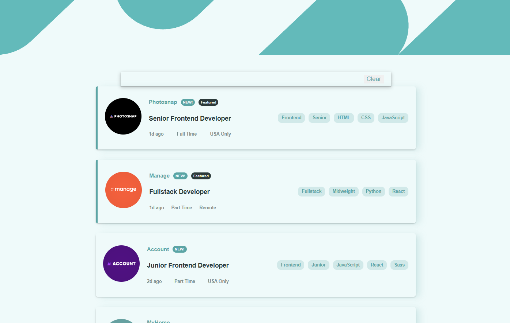

# Frontend Mentor - Job listings with filtering solution

This is a solution to the [Job listings with filtering challenge on Frontend Mentor](https://www.frontendmentor.io/challenges/job-listings-with-filtering-ivstIPCt). Frontend Mentor challenges help you improve your coding skills by building realistic projects.

## Table of contents

- [Overview](#overview)
  - [The challenge](#the-challenge)
  - [Screenshot](#screenshot)
  - [Links](#links)
- [My process](#my-process)
  - [Built with](#built-with)
  - [What I learned](#what-i-learned)
  - [Continued development](#continued-development)
  - [Useful resources](#useful-resources)
- [Author](#author)
- [Acknowledgments](#acknowledgments)

## Overview

### The challenge

Users should be able to:

- View the optimal layout for the site depending on their device's screen size
- See hover states for all interactive elements on the page
- Filter job listings based on the categories

### Screenshot



### Links

- Solution URL: [Github Repo](https://github.com/ArcidesFerrao/job-listing)
- Live Site URL: [Vercel Deployment](https://your-live-site-url.com)

## My process

### Built with

- Semantic HTML5 markup
- CSS custom properties
- Flexbox
- CSS Grid
- Mobile-first workflow
- [React](https://reactjs.org/) - JS library

### Installation

1. Clone the repository:
   ```bash
   git clone https://github.com/ArcidesFerrao/job-listing.git
   cd job-listing
   ```
2. Install dependencies:

   ```bash
   Copy code
   npm install
   ```

3. Start the development server:

   ```bash
   Copy code
   npm run dev
   ```

### Scripts

- `npm run dev`: Starts the development server.
- `npm run build`: Builds the app for production.
- `npm run preview`: Preview the production build locally.

### Tech Stack

- **Frontend**: React (via Vite)
- **Styling**: CSS/SCSS (or Tailwind CSS, specify if applicable)
- **State Management**: React Hooks
- **Build Tools**: Vite, Webpack
- **API**: Fetches job data from a placeholder or mock API (replace with actual API if applicable)

### Folder Structure

```csharp
  Copy code
  job-listing/
  ├── public/         # Static assets (e.g., images, icons)
  ├── src/            # Source files
  │   ├── components/ # Reusable UI components (e.g., JobCard, SearchBar)
  │   ├── pages/      # Page components (e.g., JobListingsPage)
  │   ├── App.jsx     # Main app component
  │   ├── index.js    # Entry point
  ├── package.json    # Dependencies and scripts
  └── README.md       # Project documentation
```

### Continued development

Use this section to outline areas that you want to continue focusing on in future projects. These could be concepts you're still not completely comfortable with or techniques you found useful that you want to refine and perfect.

## Author

- Website - [Arcides Ferrao](https://portfolio-arcidesferraos-projects.vercel.app/)
- Frontend Mentor - [@ArcidesFerrao](https://www.frontendmentor.io/profile/ArcidesFerrao)
- Twitter - [@Arcides\_](https://www.twitter.com/Arcides_)
